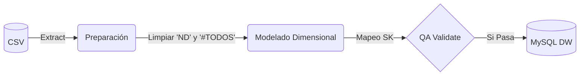
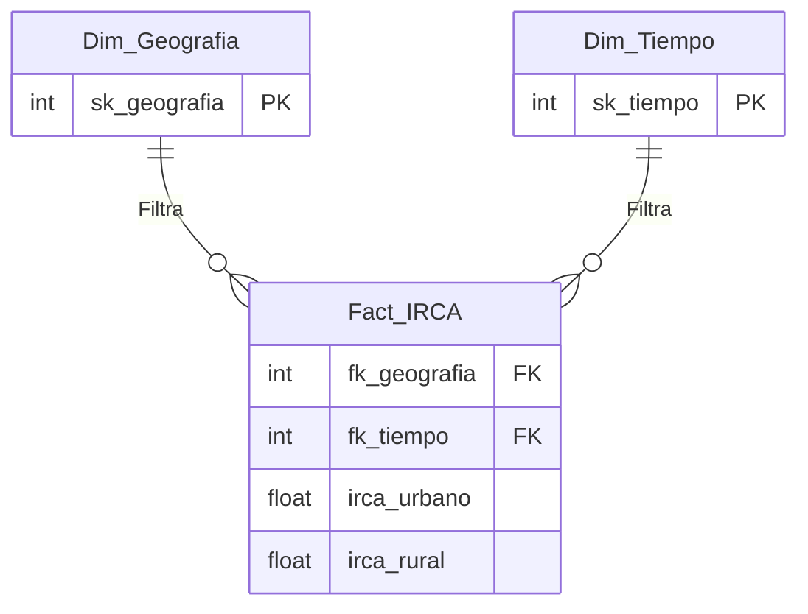

# Proyecto ETL: Ingeniería de Datos para el Desarrollo Sostenible en Colombia

## 1. Definición del Problema Colombiano y ODS
* **Título:** Análisis Dimensional de la Desigualdad en la Calidad del Agua Potable (IRCA) en Colombia.
* **ODS Seleccionado:** ODS 6 - Agua limpia y saneamiento (Meta 6.1: Acceso universal y equitativo al agua potable y segura).
* **Problema Colombiano:** Existe una brecha histórica en la provisión de servicios públicos entre los grandes centros urbanos y la ruralidad. Mientras las ciudades principales reportan niveles de IRCA categorizados como "Sin riesgo", gran cantidad de municipios apartados consumen agua con niveles de riesgo medio, alto o inviable sanitariamente.
* **Contexto Técnico (¿Qué es el IRCA?):** El Índice de Riesgo de la Calidad del Agua se expresa de 0% a 100%:
  * **0% – 5%:** Sin riesgo (Agua apta).
  * **5.1% – 14%:** Riesgo bajo.
  * **14.1% – 35%:** Riesgo medio.
  * **35.1% – 80%:** Riesgo alto.
  * **80.1% – 100%:** Inviable sanitariamente.
* **Partes Interesadas:** MinSalud, Superintendencia de SSPP, Gobernaciones, Alcaldías y ONGs.

## 2. Matriz de Requisitos Analíticos (R1-R5)

| ID | Requisito analítico | Pregunta de negocio | Decisión / conocimiento respaldado |
| :--- | :--- | :--- | :--- |
| **R1** | Analizar el cambio histórico del nivel de riesgo del agua a nivel nacional desde 2007. | ¿La calidad del agua en Colombia ha mejorado o ha empeorado con los años? | Evaluar si las políticas nacionales de salud e infraestructura están dando resultados. |
| **R2** | Identificar los departamentos que presentan el peor índice de calidad de agua en la actualidad. | ¿Cuáles son los departamentos con el agua más peligrosa hoy en día? | Priorizar envío de presupuesto nacional y ayudas de emergencia a las regiones críticas. |
| **R3** | Comparar el nivel de riesgo del agua entre la zona urbana y rural dentro de cada departamento. | ¿Qué tan grande es la desigualdad entre el campo y la ciudad en una misma región? | Focalizar acueductos y plantas de tratamiento específicamente en zonas rurales abandonadas. |
| **R4** | Detectar municipios mantenidos en niveles de "alto riesgo" constante en los últimos 5 años. | ¿Qué municipios llevan años tomando agua enferma sin ninguna mejora? | Intervenir alcaldías responsables para exigir planes de saneamiento urgente. |
| **R5** | Medir qué departamentos han logrado reducir más su riesgo de agua rural en el tiempo. | ¿Qué departamentos lograron mejorar más la calidad de su agua en el campo? | Identificar casos de éxito gubernamentales para replicar sus estrategias en otros territorios. |

## 3. Selección y Evaluación del Conjunto de Datos
* **Institución / Propietario:** Instituto Nacional de Salud (INS) - datos.gov.co.
* **Cobertura:** Nacional (Departamentos y Municipios) y Temporal (2007 - Actualidad).
* **URL / Adquisición:** https://www.datos.gov.co/Salud-y-Protecci-n-Social/Calidad-del-Agua-para-Consumo-Humano-en-Colombia/nxt2-39c3/about_data.

## 4. Trazabilidad de Requisitos a Datos

| Requisito | Atributos requeridos | Transformación necesaria | KPI / análisis esperado |
| :--- | :--- | :--- | :--- |
| **R1** | `Año`, `IRCAurbano`, `IRCArural` | Limpieza de `Año` (casteo int). Reemplazo nulos "ND". Casteo métricas a `float`. | Gráfico de líneas. KPI: Promedio Nacional IRCA. |
| **R2** | `Departamento`, `Año`, `IRCAurbano`, `IRCArural` | Filtrar `Municipio = '#TODOS'`. Filtrar por el año máximo actual. | Gráfico de barras horizontales (Top 5 peores departamentos). |
| **R3** | `Departamento`, `IRCAurbano`, `IRCArural` | Exclusión de agregaciones `#TODOS`. Derivación (Rural - Urbano). | Gráfico de columnas agrupadas. KPI: Brecha de Riesgo. |
| **R4** | `Municipio`, `Año`, `IRCArural` | Limpiar `Año`. Filtrar `Año >= (Max-5)`. Clasificación > 35%. | Matriz/Tabla de calor (Conteo de municipios críticos). |
| **R5** | `Departamento`, `Año`, `IRCArural` | Filtrar `#TODOS`. Manejo de "ND" a `NaN`. Calcular Delta temporal. | Gráfico de barras ascendente (Delta histórico). |

## 5. Estrategia de Preparación de Datos y Perfilado
Durante el Data Profiling se detectaron anomalías estructurales severas:
* **Granularidad Mixta:** Eliminación de filas `Municipio = '#TODOS'` para evitar el doble conteo y garantizar un grano atómico.
* **Nulos Encubiertos:** Reemplazo estricto del string `"ND"` por nulos reales (`NaN`) para no sesgar promedios matemáticos.
* **Contaminación de Formatos:** Eliminación de comas y separadores de miles en años y medidas, transformando a tipos `float` e `int` nativos.

## 6. Declaración del Grano y Arquitectura del Sistema
* **Grano:** "Una fila en `Fact_IRCA` representa la medición anual consolidada del Índice de Riesgo de la Calidad del Agua (IRCA), diferenciada por zona urbana y rural, para un municipio específico de Colombia."
* **Proceso de Negocio:** Medición de seguridad del agua de consumo.

**Arquitectura ETL:**

## 7. Esquema Estrella y Justificación

*   `Dim_Tiempo`: Requerida para agrupaciones históricas (R1, R4, R5).
*   `Dim_Geografia`: Desnormalizada para análisis territoriales fluidos (R2, R3).
*   `Fact_IRCA`: Centraliza las medidas numéricas. Llave primaria compuesta para blindar el grano.

## 8. Validación de Requisitos al Modelo Dimensional

| Requisito | Dimensión(es) | Medida(s) | Consulta/KPI esperado | ¿Soportado? |
| :--- | :--- | :--- | :--- | :--- |
| **R1** | `Dim_Tiempo` | `irca_urbano`, `irca_rural` | `AVG(irca)` agrupado por `anio` (Gráfico de líneas) | Sí |
| **R2** | `Dim_Geografia`, `Dim_Tiempo` | `irca_urbano`, `irca_rural` | Top 5 `AVG(irca)` por `departamento` donde anio = MAX | Sí |
| **R3** | `Dim_Geografia` | `irca_urbano`, `irca_rural` | `AVG(rural) - AVG(urbano)` agrupado por `departamento` | Sí |
| **R4** | `Dim_Geografia`, `Dim_Tiempo` | `irca_rural` | Conteo agrupado por `municipio` donde `irca > 35` (5 años) | Sí |
| **R5** | `Dim_Geografia`, `Dim_Tiempo` | `irca_rural` | Delta `AVG(irca_rural)` Año Max vs Año Min por `departamento` | Sí |

## 9. Implementación del Data Warehouse y Reproducción
1. Entorno virtual: `pip install pandas numpy sqlalchemy pymysql python-dotenv`
2. Configurar el archivo `.env` en la raíz con credenciales de MySQL (puerto 3306).
3. Asegurar dataset en `data/raw/`.
4. Ejecutar orquestador: `python src/main.py`. *(Crea automáticamente la BD `dw_calidad_agua_colombia`, las tablas con constraints PK/FK y carga los datos).*

## 10. Consultas Analíticas (SQL) e Inteligencia de Negocios
Las consultas SQL documentadas se encuentran en `sql/analytical_queries.sql`.
El Dashboard de **Power BI** conecta directo al DW de MySQL e incorpora:
* Medidas DAX específicas para el análisis de la Brecha Urbana-Rural y el Progreso Histórico de reducción de riesgo.
* Gráficos y visualizaciones estructuradas para dar respuesta exacta a cada requerimiento (R1-R5).

## 11. Hallazgos Principales
1. **Desigualdad Sistémica:** La "brecha" entre campo y ciudad es positivamente amplia en la inmensa mayoría de departamentos.
2. **Focos de Alerta Continua:** Departamentos periféricos se han mantenido en niveles de "Alto Riesgo" ininterrumpidamente durante el último quinquenio.
3. **Casos de Éxito:** Regiones céntricas muestran las mayores reducciones (deltas negativos) de IRCA rural, marcando la pauta en políticas públicas.

## 12. Integrantes del Equipo
* **[TU NOMBRE AQUÍ]** - Rol: Data Engineer / Analista BI.
