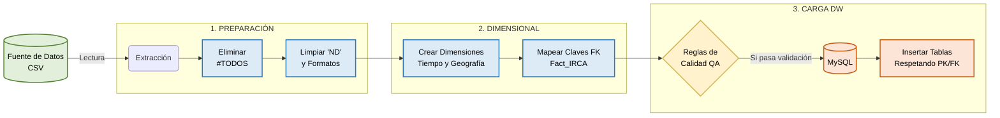

# ETL Architecture Pipeline

Este diagrama ilustra el flujo de datos desde la extracción del archivo crudo hasta su carga en el Data Warehouse, mostrando las transformaciones específicas aplicadas.

