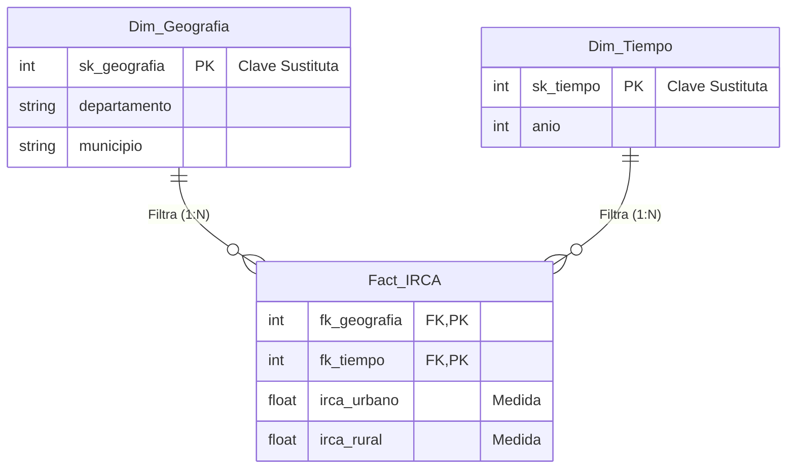

# Esquema Estrella (Star Schema)

El modelo dimensional implementado para dar respuesta a los requerimientos analíticos (R1-R5). Centraliza las medidas numéricas del IRCA y las aisla en dimensiones geográficas y temporales.

